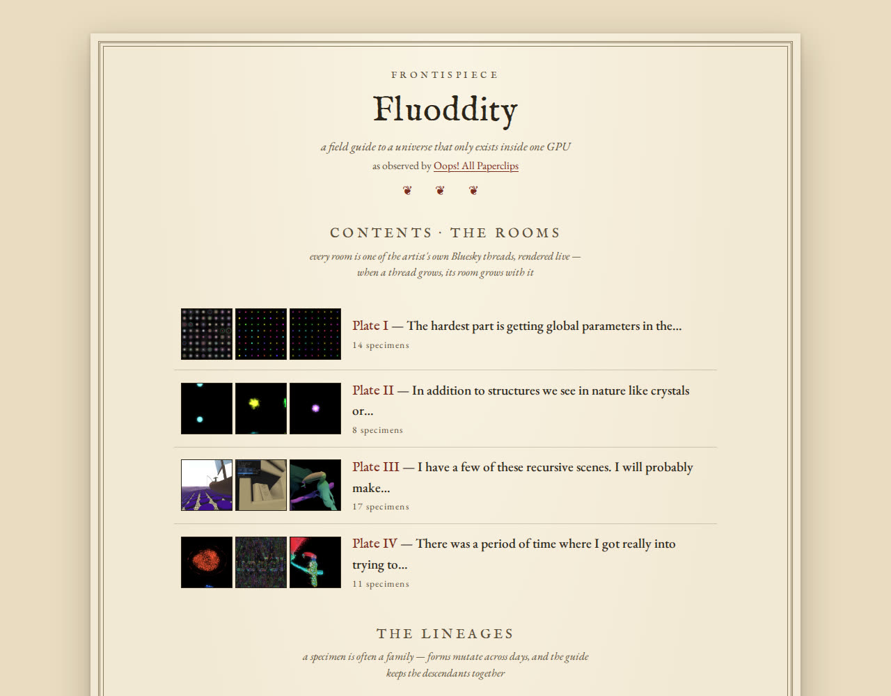
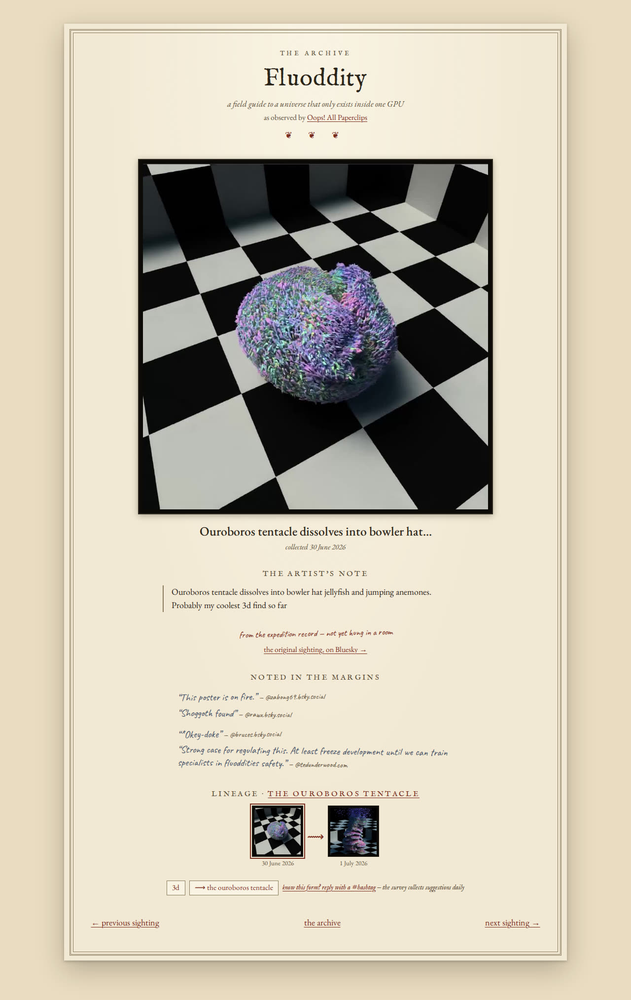
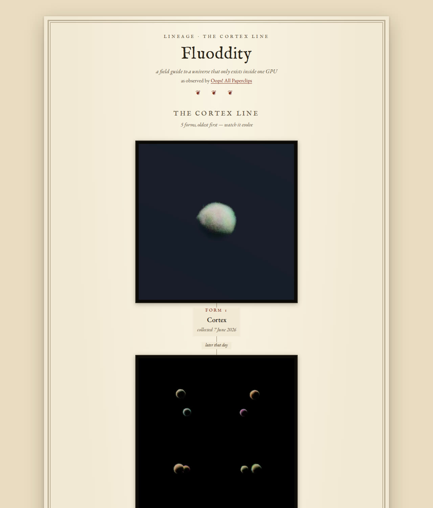
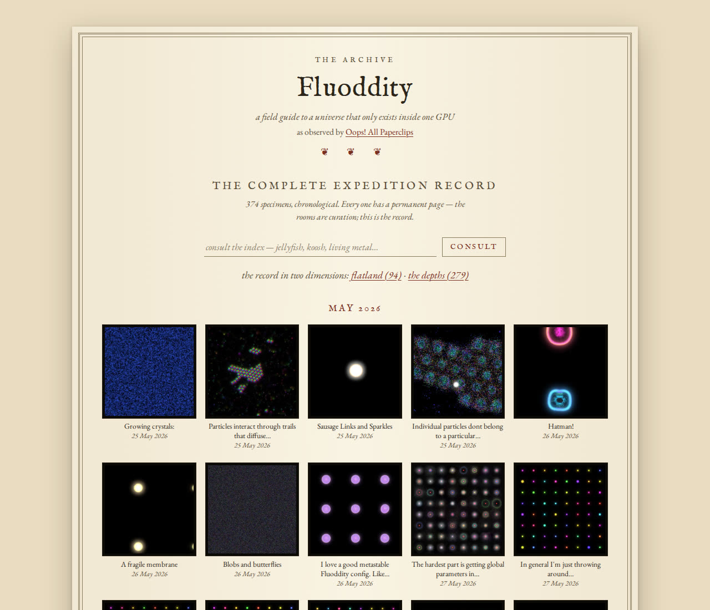

# Fluoddity — a field guide

> A naturalist's field guide to a universe that only exists inside one GPU.
>
> **https://fluoddity.observer** — *as observed by Oops! All Paperclips.*

[Oops! All Paperclips](https://bsky.app/profile/all-paperclips.bsky.social)
grows things inside a GPU: millions of particles, each with a tiny evolvable
brain, leaving trails and reading the trails of their neighbors — and out of
that, jellyfish. Party hats. Ouroboros tentacles that dissolve into
bowler-hat medusae. He calls the system *Fluoddity*, and he posts his
findings to Bluesky like a naturalist filing dispatches from an expedition
no one else can visit.

Timelines scroll away. Field guides do not. This site gives every specimen a
permanent, linkable page — the loop itself, the artist's caption preserved
word for word, the date of collection — and hangs the survey's selections in
rooms where the community's reactions become notes in the margins.

Born from [a wish by @norvid-studies](https://bsky.app/profile/norvid-studies.bsky.social/post/3mpli4fvzns22).



## What's in the guide

- **The Archive** — the complete expedition record, chronological: every
  video loop and still image the artist has posted, each with its own page.
  Specimen pages turn like notebook pages (previous / next sighting), and
  the record can be split into *flatland* (2D) and *the depths* (3D).
- **Rooms** — every room is one of the artist's own Bluesky threads,
  rendered live. When the thread grows, the room grows with it. Other
  people's threads hang as **Guest Rooms** — see "rooms are threads," below.
- **Lineages** — a specimen is often a family. Forms mutate across days,
  and the guide draws each family as an evolution chart: one descent line,
  oldest form at the top, with the time between sightings written on the
  stem the way a field notebook would ("later that day," "8 days pass").
- **The Index** — search every caption, tag, and image description at
  [/search](https://fluoddity.observer/search). The captions are half the
  art; they're all searchable.
- **Behold mode** — click any specimen and the notebook falls away:
  full-bleed loop glowing in the dark. Tap or `Esc` to return.
- **Ambient mode** — [lights off, let the collection play](https://fluoddity.observer/ambient).
  A slow, endless exhibition: videos loop, stills hold like projector
  slides, a label breathes in and out. Any room, lineage, or tag can be
  projected (`space` skips, `Esc` leaves).
- **Margin notes** — real Bluesky quote-posts, attributed, refreshed daily.
  The only editorial voice in the guide besides the artist's is the
  community's.
- **Dispatches by feed** — new sightings as an Atom feed at
  [/feed.xml](https://fluoddity.observer/feed.xml), for wherever you read.

New posts flow in on their own: the guide polls the artist's feed every few
minutes, so a sighting posted on Bluesky has its permanent page within
moments, no one lifting a finger.

A specimen page — the loop, the artist's note, real quote-posts in the
margins, its lineage, and the page-turn to the next sighting:



A lineage, drawn as one descent line with the time between sightings
written on the stem — and the archive's ledger, month by month:

| the evolution chart | the expedition record |
|---|---|
|  |  |

## Taking part (without leaving Bluesky)

The guide reads Bluesky; you never need an account here.

- **Suggest a tag** — reply to one of the artist's original posts with a
  `#hashtag` (or quote-post it with one). A daily sweep files your
  suggestion for the curator's desk; if the survey takes it up, the tag
  hangs with **your name on the wall label** — every tag chip shows who
  placed it.
- **Suggest a tag, faster** — mention **@fluoddity.observer** in that reply
  and the suggestion files within the minute, with an acknowledgement.
- **Hang your own room** — make a thread of your favorite pieces
  (quote-posts or links to the artist's work), mention
  **@fluoddity.observer** anywhere in it, and the bot replies with your
  thread's live room link. Keep adding to the thread; the room keeps
  growing. Threads with real specimens are also filed for the curators,
  who can hang them on the homepage as Guest Rooms.
- **Say `!help`** — the bot introduces itself and explains all of this
  in-thread.
- **The weekly wrap-up** — once a week the gallery account posts that
  week's most-liked specimens (never more than three, and nothing at all
  in a quiet week — the guide is not a content quota).

Only the artist's work ever renders. A thread can't inject foreign media
into a room, and every suggestion passes a curator before it touches the
guide.

## For the artist

The system is yours; the guide knows it.

- **Captions are preserved verbatim, always.** No paraphrase, no cleanup.
- **Your word is the taxonomy.** `#hashtags` in your captions become tags
  automatically — and so do hashtags in your *replies* to your own posts,
  no approval step, so you can tag (and correct) the archive from inside
  Bluesky without ever visiting the site.
- **Your threads are the museum's plates.** Registered artist threads are
  the first-class rooms on the front page, numbered like engravings.
- The rooms and lineages here are a provisional survey assembled from your
  own vocabulary. The guide expects to be corrected — curation is visible
  by design, and wall labels always say who selected what.

## Rooms are threads

Every room is a **Bluesky thread** — there is no other kind. Posts are the
walk-through, post text becomes the wall labels, the root post is the
introduction at the door. Threads render live at `/room/{handle}/{rkey}`
(five-minute cache): edit the thread and the room follows. Viewing any
thread as a room is permissionless; the homepage registry is curated.

---

## Under the hood

Rust (Axum + Maud + SQLx/Postgres), server-rendered, no client framework.
Media serves from the Bluesky CDNs in hosted mode (HLS video via hls.js,
stills from the image CDN) — the site hosts no media. Background work
(ingest polling, suggestion harvest, margin-note refresh, bot mentions,
weekly wrap-up) runs on the cja cron + durable-job system with retries and
a dead-letter queue.

### Running locally

```bash
createdb paperclips_gallery
cargo run -- import       # seed from metadata.jsonl + catalog.json (migrations run on boot)
cargo run                 # serve on :4601
```

Subcommands: `serve` (default), `import`, `ingest-once`, `harvest-once`,
`pull-media`, `refresh-notes`, `classify-dimensions`, `bot-once`,
`bot-weekly`, `gen-oauth-key`.

| var | default | meaning |
|---|---|---|
| `PCG_PORT` | `4601` | listen port |
| `DATABASE_URL` | (required) | Postgres connection string (see `.mise.toml`) |
| `PCG_MEDIA_MODE` | `local` | `local` (files from `PCG_MEDIA_DIR`) or `cdn` (Bluesky CDNs, nothing hosted) |
| `PCG_MEDIA_DIR` | — | local media archive, for `local` mode and `pull-media` |
| `PCG_POLL_SECS` | `300` | ingest poll interval; `0` disables |
| `PCG_PUBLIC_URL` | — | hosted base URL (enables confidential OAuth; links in bot replies) |
| `PCG_ADMIN_DIDS` | — | comma-separated `did[=handle]` curator roster seed |
| `PCG_BOT_HANDLE` / `PCG_BOT_PASSWORD` | — | gallery account + **app password**; unset = bot disabled |

The database is the source of truth. `import` seeds it from the flat-file
era (`metadata.jsonl` + `catalog.json`) and is idempotent; everything after
that — live ingest, tags, suggestions, rooms — accumulates in Postgres.
`pull-media` cold-stores original blobs from the artist's PDS for any
specimen the local archive is missing.

### The curator's desk

`/admin` signs in with **Bluesky OAuth, identity only** — you approve on
your own PDS, the site checks your DID against the curator roster and
discards the tokens immediately. Curators register rooms, tag specimens
inline, and work the suggestion box (community tags and rooms awaiting the
wall). Hosted mode is a confidential OAuth client
(`PCG_OAUTH_PRIVATE_KEY`, generate with `gen-oauth-key`); dev mode is a
loopback client (reach the site via `127.0.0.1`).

### CI & deploy

GitHub Actions: fmt, clippy (`-D warnings`), SQLx prepare-check + tests
against a Postgres service, cargo-deny, conventional-commit PR titles, and
a `ready` aggregator. Pushes to `main` deploy to Fly. When queries change:
`cargo sqlx prepare -- --all-targets` and commit `.sqlx`.
